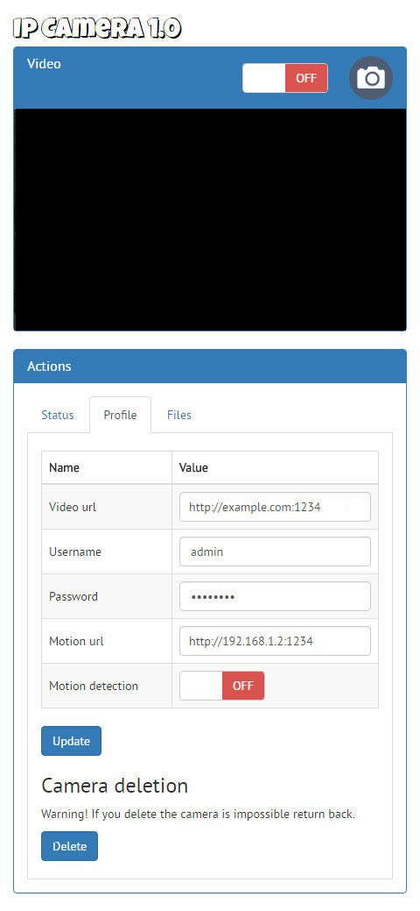

Ip Camera cp
==============

This is a open source Ip Camera control panel with motion and FFMPEG framework

| Features |
|:---|
| Full responsive (smartphone, tablet, pc) |
| Multibrowser (Chrome, firefox, internet explorer, opera, safari) |
| Work with a lot model of ip camera |
| Remote camera control (Move and take picture) |
| Check status |
| Profile management |
| Set motion tracking |
| Add and remove camera without write code |
| Files management |

## Images

## Instructions:
1) On linux, open terminal and write:

	sudo apt-get update
	
	sudo apt-get install motion
	
	sudo nano /etc/motion/motion.conf

2) Edit:

	daemon on
	
	process_id_file /var/run/motion/motion.pid

	output_normal off ! Get image when detecting a movement !

	ffmpeg_cap_new off ! Get video when detecting a movement !

	ffmpeg_video_codec msmpeg4

	text_right %Y-%m-%d\n%T | %q

	snapshot_filename %v | %Y-%m-%d | %H:%M:%S | snapshot

	jpeg_filename %v | %Y-%m-%d | %H:%M:%S | %q

	movie_filename %v | %Y-%m-%d | %H:%M:%S

	timelapse_filename %Y-%m-%d | timelapse

	webcam_port 0

	control_port 32402

	control_localhost on

	control_html_output off

	thread /YOUR_PATH/motion/camera_1.conf

3) Save, close file and on linux, open terminal and write:

	sudo chmod 666 /etc/motion/motion.conf

	sudo nano /etc/default/motion

4) Edit:

	start_motion_daemon=yes

5) Save, close file and on linux, open terminal and write:

	sudo mkdir /YOUR_PATH/motion

	sudo chown YOUR_USER:www-data /YOUR_PATH/motion

	sudo chmod 775 /YOUR_PATH/motion

	sudo mkdir /YOUR_PATH/motion/camera_1

	sudo nano /YOUR_PATH/motion/camera_1.conf

6) Insert:

	framerate 30

	netcam_url http://YOUR_CAMERA_IP:YOUR_CAMERA_PORT/videostream.cgi?user=admin&pwd=Password1&resolution=32;

	netcam_http 1.0

	threshold 1500

	ffmpeg_cap_new on

	output_normal off

	target_dir /YOUR_PATH/motion/camera_1

7) Save, close file and on linux, open terminal and write:

	sudo chmod 777 $(find /YOUR_PATH/motion -type d)

	sudo chmod 664 $(find /YOUR_PATH/motion -type f)

8) Go on your browser and write <b>"http://YOUR_IP/ipcamera_cp/web/index.php"</b>

<b>By CIMO - www.reinventsoftware.org</b>